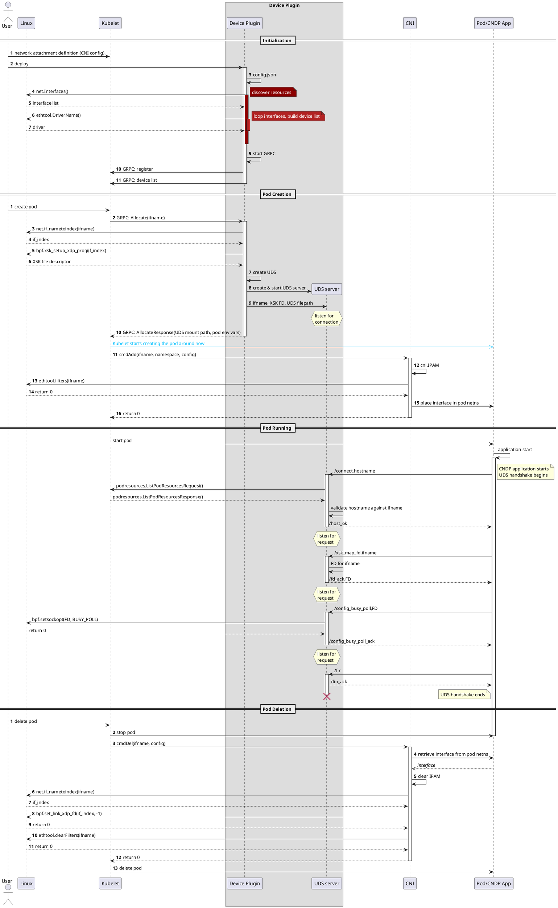

# CNDP Device Plugin

A proof of concept Kubernetes device plugin and CNI plugin to provide AF_XDP networking to Kubernetes pods using Intel's Cloud Native Data Plane framework.

## Clone and Build

```bash
git clone ssh://git@gitlab.devtools.intel.com:29418/OrchSW/CNO/containers_afxdp_network_device_plugin-.git
cd containers_afxdp_network_device_plugin-/
./build.sh
```
Two binaries will be placed in ./bin directory:
- **cndp-dp** is the device plugin
- **cndp** is the CNI plugin. This needs to be placed in `/opt/cni/bin/`

## Device Plugin Config
The device plugin currently reads a list of devices from a config file, rather than actual device discovery. A sample config file can be found in `examples/sample-config/`
For actual testing with the CNI, the config file should be updated to include only the names of real netdevs that exist on the node.
By default the device plugin will search for `config.json` in the current directory. An alternative path can be provided using the `-config` flag, e.g.
```bash
./bin/cndp-dp -config ./examples/sample-config/config.json
```

## CLOC
Output from CLOC (count lines of code) - github.com/AlDanial/cloc 
<!---clocstart--->
```
-------------------------------------------------------------------------------
Language                     files          blank        comment           code
-------------------------------------------------------------------------------
Go                              18            411            570           3689
Markdown                         3             52              0            196
Bourne Shell                     2             21              3            194
YAML                             5              3              0            100
C                                2             21             26             91
make                             1             10              4             38
C/C++ Header                     2             14             28             24
JSON                             3              0              0             24
Dockerfile                       1              0              0              3
-------------------------------------------------------------------------------
SUM:                            37            532            631           4359
-------------------------------------------------------------------------------

```
<!---clocend--->

## Sequence Diagram

