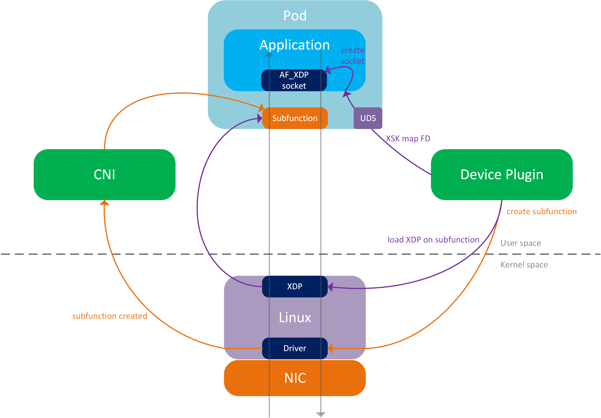
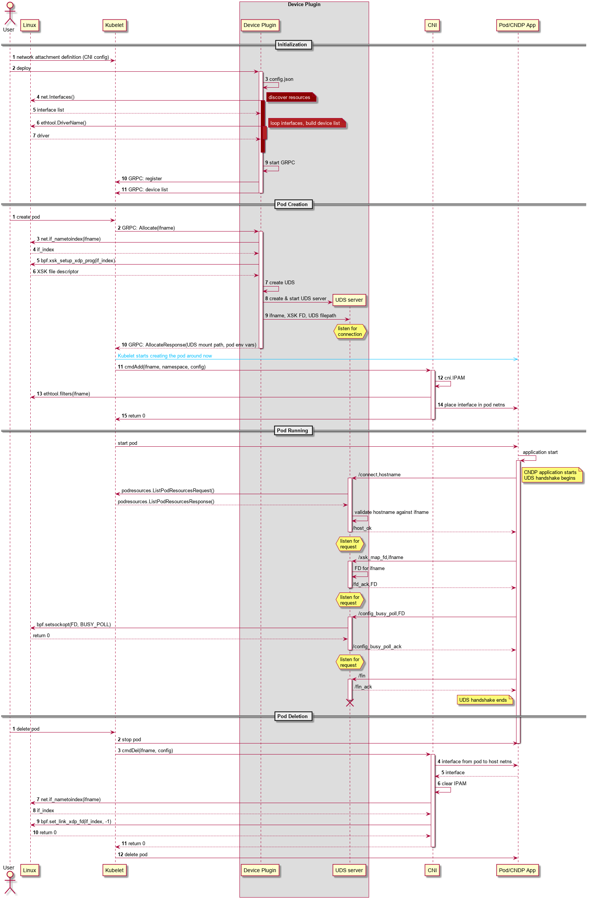

[](https://github.com/marketplace/actions/super-linter)   [](https://api.securityscorecards.dev/projects/github.com/intel/afxdp-plugins-for-kubernetes) [](https://goreportcard.com/report/github.com/intel/afxdp-plugins-for-kubernetes) [](https://pkg.go.dev/github.com/intel/afxdp-plugins-for-kubernetes)

# AF_XDP Plugins for Kubernetes

A Kubernetes device plugin and CNI plugin to provide AF_XDP networking to Kubernetes pods.

## Deploy the Plugins

Assuming you have a functional Kubernetes cluster and environment as described in the [prerequisites](#running-the-plugins), the plugins can be deployed with the following command: `kubectl apply -f https://raw.githubusercontent.com/intel/afxdp-plugins-for-kubernetes/main/deployments/daemonset.yml`

This will deploy the daemonset with the default configuration described in [deployments/daemonset.yml](./deployments/daemonset.yml).
Alternatively, to customize the configuration:

- Download daemonset.yaml: `wget https://raw.githubusercontent.com/intel/afxdp-plugins-for-kubernetes/main/deployments/daemonset.yml`
- Update daemonset.yml with the required configuration. See the [Device Plugin Config](#device-plugin-config) section.
- Deploy the plugins with the updated config: `kubectl create -f daemonset.yml`

## Running AF_XDP Pods

- Create a network attachment definition file. This is the config for the CNI plugin.
  - An example file can be found under [examples/network-attachment-definition.yaml](./examples/network-attachment-definition.yaml)
  - Change the config if necessary. See comments in the example file.
  - `kubectl create -f network-attachment-definition.yaml`
- Create a pod spec:
  - An example pod spec can be found under [examples/pod-spec.yaml](./examples/pod-spec.yaml)
  - Configure the pod spec to use a suitable Docker image and to reference the network attachment definition as well as the resource type from the Device Plugin. See comments in the example file.
  - `kubectl create -f pod-spec.yaml`

## Prerequisites

### Running the Plugins

The following prerequisites are required to run the plugins:

- **OS**
  - Any OS that supports Kubernetes should work.
  - Tested on Ubuntu 20.04.
- **Kernel**
  - AF_XDP support started from Linux kernel 4.18.
- **Docker (or more recently Podman)**
  - All recent versions should work.
  - Tested on `20.10.5`, `20.10.7`, `20.10.12`, `20.10.14`, `20.10.18`.
  - **Note:** You may need to disable memlock on Docker.
  Add the following section to `/etc/docker/daemon.json`:

    ```yaml
    "default-ulimits": {
    "memlock": {
        "Name": "memlock",
        "Hard": -1,
        "Soft": -1
        }
    }
    ```

    Restart the Docker service: `systemctl restart docker.service`
- **Kubernetes**
  - All recent versions should work.
  - Tested on `1.20.2`, `1.21.1`, `v1.22.4`, `v1.22.8`, `v1.23.0`, `v1.23.5`.
- **A CNI network**
  - To serve as the [default network](https://github.com/k8snetworkplumbingwg/multus-cni/blob/master/docs/quickstart.md#key-concepts) to the Kubernetes pods.
  - Any CNI should work. Tested with [Flannel](https://github.com/flannel-io/flannel).
- **Multus CNI**
  - To enable attaching of multiple network interfaces to pods.
  - [Multus quickstart guide](https://github.com/k8snetworkplumbingwg/multus-cni/blob/master/docs/quickstart.md).
- **Kind**
  - To use a Kind deployment.
  - [Kind quickstart guide](https://kind.sigs.k8s.io/docs/user/quick-start/)
  - Tested with Kind version 0.18.0
  - **Note:** For kind, please also install [**kubeadm**](https://kubernetes.io/docs/setup/production-environment/tools/kubeadm/install-kubeadm/)

### Development Prerequisites

The following prerequisites are required to build and deploy the plugins from source:

- **GoLang**
  - To build the plugin binaries.
  - All recent versions should work.
  - Tested on `1.13.8`, `1.15.15`, `1.17`, `1.17.1`, `1.17.8`, `1.18`, `1.19`.
  - [Download and install](https://golang.org/doc/install).
- **Libbpf**
  - To load and unload the XDP program onto the network device.
  - Install on Ubuntu 20.10+: `apt install libbpf-dev`
  - Older versions: [Install from source](https://github.com/libbpf/libbpf#build).
- **GCC Compiler**
  - To compile the C code used to call on the BPF Library.
  - Install on Ubuntu: `apt install build-essential`
- **Binutils**
  - Used in archiving of C code object file.
  - Install on Ubuntu: `apt install binutils`
- **Clang**
  - Compiling the bpf progs for Kind.
  - Install on Ubuntu: `apt install clang`
- **gcc-multilib**
  - Compiling the bpf progs for Kind.
  - Install on Ubuntu: `apt install gcc-multilib`
- **llvm**
  - Compiling the bpf progs for Kind.
  - Install on Ubuntu: `apt install llvm`

### Static analysis, linting and formatting

The following static analysis, linting and formatting tools are not required for building and deploying but are built into some of the Make targets and enforced by CI. It is recommended to have these installed on your development system.

- **[GoFmt](https://pkg.go.dev/cmd/gofmt)**
  - Applies standard formatting to Go code.
  - Supplied with GoLang.
- **[Go Vet](https://pkg.go.dev/cmd/vet)**
  - Examines Go source code and reports suspicious constructs.
  - Supplied with GoLang.
- **[GolangCI-Lint](https://golangci-lint.run/)**
  - A Go linters aggregator.
  - Install: `curl -sSfL https://raw.githubusercontent.com/golangci/golangci-lint/master/install.sh | sh -s -- -b $(go env GOPATH)/bin v1.42.1`
- **[Hadolint](https://github.com/hadolint/hadolint)**
  - A Dockerfile linter that helps build best practice into Docker images.
  - Runs in Docker container.
- **[Shellcheck](https://github.com/koalaman/shellcheck)**
  - A static analysis tool for shell scripts.
  - Install on Ubuntu: `apt install shellcheck`
- **[Clang Format](https://clang.llvm.org/docs/ClangFormat.html)**
  - Applies standard formatting to C code.
  - Install on Ubuntu: `apt install clang-format`
- **[CLOC](https://github.com/AlDanial/cloc)**
  - Count Lines Of Code, counts lines of code in many programming languages.
  - Install on Ubuntu: `apt install cloc`
- **[Staticcheck](https://staticcheck.io/docs/getting-started/)**
  - Static analysis tool used to perform debugging, identify performance issues, style rules and highlights code simplifications.
  - Golang package which requires go environment `go install honnef.co/go/tools/cmd/staticcheck@latest`
- **[Trivy](https://github.com/aquasecurity/trivy)**
  - A comprehensive and versatile security scanner.
  - [Install on Ubuntu](https://aquasecurity.github.io/trivy/v0.38/getting-started/installation/):

    ```bash
    sudo apt-get install wget apt-transport-https gnupg lsb-release
    wget -qO - https://aquasecurity.github.io/trivy-repo/deb/public.key | gpg --dearmor | sudo tee /usr/share/keyrings/trivy.gpg > /dev/null
    echo "deb [signed-by=/usr/share/keyrings/trivy.gpg] https://aquasecurity.github.io/trivy-repo/deb $(lsb_release -sc) main" | sudo tee -a /etc/apt/sources.list.d/trivy.list
    sudo apt-get update
    sudo apt-get install trivy
    ```

## Build and Deploy from Source

- Clone this repo and `cd` into it.
- Optional: Update configuration. See [Device Plugin Config](#device-plugin-config).
- Run `make deploy`.

The following steps happen **automatically**:

1. `make build` is executed, resulting in CNI and Device Plugin binaries in `./bin`.
2. `make image` is executed, resulting in the creation of a new Docker image that includes the CNI and Device Plugin binaries.
    > **_NOTE:_** If testing on a multi-node cluster. The current absence of a Docker registry means this image will first need to be manually copied to all nodes (or rebuilt on all nodes using: `make image`).*
3. The daemonset will run on all nodes, installing the CNI and starting the Device Plugin running on each node.

The CNI and Device Plugin are now deployed.

## Deploying on Kind

- Clone this repo and `cd` into it.
- Optional: Update the Kind configuration files: `hack/kind-config.yaml` and `deployments/daemonset-kind.yaml`.
- Run `make run-on-kind`.

This will deploy a kind cluster with a control plane and two worker nodes. It will build and run the DP daemonset, and install the CNI on all nodes.

### Running Pods

- Create a network attachment definition file. This is the config for the CNI plugin.
  - An example file can be found under [examples/network-attachment-definition.yaml](./examples/network-attachment-definition.yaml)
  - Change the config if necessary. See comments in the example file.
  - `kubectl create -f network-attachment-definition.yaml`
- Create a pod spec:
  - An example pod spec can be found under [examples/kind-pod-spec.yaml](./examples/kind-pod-spec.yaml)
  - Configure the pod spec to use a suitable Docker image and to reference the network attachment definition as well as the resource type from the Device Plugin. See comments in the example file.
  - `kubectl create -f kind-pod-spec.yaml`

> **_NOTE:_** With kind, you will need to give the pods CAP_BPF privilege UNLESS you run the following commands: `docker exec <node-name> sudo sysctl kernel.unprivileged_bpf_disabled=0`. Where node names are: af-xdp-deployment-worker and af-xdp-deployment-worker2.

## Device Plugin Config

Under normal circumstances the device plugin config is set as part of a config map at the top of the [daemonset.yml](./deployments/daemonset.yml) file.

The device plugin binary can also be run manually on the host for development and testing purposes. In these scenarios the device plugin will search for a `config.json` file in its current directory, or the device plugin can be pointed to a config file using the `-config` flag followed by a filepath.

In both scenarios, daemonset deployment or manually running the binary, the structure of the config is identical JSON format.

### Pools

The device plugin has a concept of device pools. Devices in this case being network devices, netdevs. The device plugin can simultaneously have multiple pools of devices. Different pools can have different configurations to suit different use cases. Devices can be added/configured to the pool in a few different ways, explained below.
Pools have two required fields, a **name** and a **mode**.

The **name** is the unique name used to identify a pool. The name is used in the pod spec to request devices from this pool. For example, if a pool is named `myPool`, any pods requiring devices from this pool will request resources of type `afxdp/myPool`.

The **mode** is the mode this pool operates in. Mode determines how pools scale and there are currently two accepted modes - `primary` and `cdq`. Primary mode means there is no scaling, the AF_XDP pod is provided with the full NIC port (the primary device). CDQ mode means that subfunctions will be used to scale the pool, so pods each get their own secondary device (a subfunction) meaning many pods can share a primary device (NIC port).
Additional secondary device modes are planned.

The example below shows how to configure two pools in different modes.

> **_NOTE:_**  Currently, CDQ is not publicly available yet, but will be in the future.
```yaml
{
   "pools":[
      {
         "name": "myCdqPool",
         "mode": "cdq"
      },
      {
         "name": "myPrimarypool",
         "mode": "primary"
      }
   ]
}
```

> **_NOTE_1:_** that the above is not a fully working example as the pools have not yet been configured with devices. This will not pass the device plugin's config validation.

> **_NOTE_2:_** Each pool created will require its own network attachment definition. See the [Running Pods](#running-pods) section above and the [network-attachment-definition.yaml](./examples/network-attachment-definition.yaml) example file for more info. The resource name provided as `k8s.v1.cni.cncf.io/resourceName` must match the pool name.

### Pool Drivers

In production environments, the most common way to add devices to a pool is through configuring drivers for that pool. When a driver is configured to a pool, the device plugin will search the node for devices using this driver and add them to that pool. A pool can have multiple drivers associated with it. Drivers are identified by their name.

The example below shows how to configure a single pool that is associated with two drivers.

```yaml
{
   "pools":[
      {
         "name": "myPool",
         "mode": "primary",
         "drivers":[
            {
               "name": "i40e"
            },
            {
               "name": "ice"
            }
         ]
      }
   ]
}

```

In the example above the device plugin will assign all devices of driver type `i40e` and `ice` to the pool `myPool`. The following explains how to add optional configurations that will limit the devices assigned per driver:

- The **primary** field is an integer and it sets the maximum number of primary devices this pool will take, per node.
- The **secondary** field is an integer and, if the pool is in a secondary device mode such as cdq, sets the maximum number of secondary devices this pool will create, per primary device.
- The **excludeDevices** field is an array of devices. Any primary device identified in this array will **not** be added to the pool. See [Pool Devices](#pool-devices) for more info on identifying devices.
- The **excludeAddressed** field is a boolean and, if true, does **not** add any device with an IPv4 address to the pool.

In the example below a single pool is given the **name** `myPool`. The pool **mode** is `cdq`, meaning the device plugin will create subfunctions on top of the primary devices. To add primary devices to the pool the **drivers** field is used. In this case a single driver is identified by its **name**, `ice`, meaning the pool will be assigned primary devices that use the ice driver. To limit the number of primary ice devices assigned to the pool the **primary** field in this driver is set to `2`, meaning only two ice devices (per node) will be assigned to this pool. Also, in use here is the **excludeDevices** field. Two excluded devices are identified in this case by their **name**, `ens802f1` and `ens802f2`. As above, this pool will take two primary devices per node, neither will be ens802f1 or ens802f2. Finally, the **secondary** field is set to `50`, meaning 50 secondary devices will be created per primary device. Since the pool mode in this case is cdq, it means those secondary devices will be subfunctions.

In summary: The pool `afxdp/myPool` will take two ice devices per node, where available. It will create a maximum of 50 subfunctions on top of each of those devices, meaning each node will have a maximum of 100 subfunctions. The devices ens802f1 and ens802f2 will not be used in this pool.

```yaml
{
   "pools":[
      {
         "name": "myPool",
         "mode": "cdq",
         "drivers":[
            {
               "name": "ice",
               "primary": 2,
               "secondary": 50,
               "excludeDevices":[
                  {
                     "name": "ens802f1"
                  },
                  {
                     "name": "ens802f2"
                  }
               ]
            }
         ]
      }
   ]
}
```

### Pool Devices

In addition to drivers, it is also possible to assign individual primary devices to a pool. This is not as scalable as drivers, so is intended more for smaller clusters or test environments. It should be noted that a pool can be assigned devices and drivers simultaneously.

Devices can be identified in three ways: Name, MAC and PCI. Only one form of identification can be used per device.
Like drivers, devices also have an optional secondary field that limits the number of secondary devices to be created on top of the identified primary device.

In the example below a single pool is given the **name** `myPool`. The pool **mode** is `cdq`, meaning the device plugin will create subfunctions on top of the primary devices. To add primary devices to the pool the **devices** field is used. In this case three devices have been added:

- The first device identified by its **name** is `ens801f0`
- The second device identified by its **mac** address is `68:05:ca:2d:e9:1b`
- The third device identified by its **pci** address is `0000:81:00.1`

The three devices, `ens801f0`, `68:05:ca:2d:e9:1b` and `0000:81:00.1` have the **secondary** field set to `10`, `20` and `30`, meaning the device plugin will create 10, 20 and 30 secondary devices on these devices, respectively. Since the pool mode in this case is cdq, it means those secondary devices will be subfunctions.

```yaml
{
   "pools":[
      {
         "name": "myPool",
         "mode": "cdq",
         "devices":[
            {
               "name": "ens801f0",
               "secondary": 10
            },
            {
               "mac": "68:05:ca:2d:e9:1b",
               "secondary": 20
            },
            {
               "pci": "0000:81:00.1",
               "secondary": 30
            }
         ]
      }
   ]
}
```

### Pool Nodes

Pools have the option to include per-node configurations. This is done via the **nodes** field within the pool config. In general all nodes will adhere to the general configuration of the pool, meaning nodes will be assigned [devices](#pool-devices) or [drivers](#pool-drivers) as described in the sections above. However, if a node is listed under the nodes field of the pool, the device plugin will apply a unique configuration for that particular node. This means that on chosen nodes the pool can be configured with custom device and driver settings.

It should be noted that pools do not require the general device or driver configurations and a pool can be configured entirely with per-node configurations, if desired.

Nodes are identified by their **hostname**. This is the hostname as it would appear when running the command `kubectl get nodes`. Nodes are configured with [devices](#pool-devices) and [drivers](#pool-drivers) exactly as described in the corresponding sections above.

In the example below a single pool is given the **name**  `myPool`. The pool **mode** is `cdq`, meaning the device plugin will create subfunctions on top of the primary devices. For this pool, the **drivers** field is configured so that most nodes will assign all their `ice` devices, but will exclude any ice device named `ens801f3` due to it being listed under **excludedDevices**.
However, there are also three node-specific configs included:

- The first node with **hostname** `k8snode1` is simply configured to assign `ice` devices to the pool. This is very similar to the general pool config for `myPool`, except there are no excluded devices. If `ens801f3` exists on this node, it will be added to `myPool`.

- The second node with **hostname**  `k8snode2` is configured with both devices and drivers:
  - Two **devices**, `ens801f3` and `ens801f1`, will be added to `myPool` from `k8snode2`.

  - There is one driver configured under the **drivers** field, the driver is named `ice`. The **primary** setting of `1` means only one of the available ice devices will be added form `k8snode2` and the **excludedDevices** setting ensures this device will not be `ens801f2`.

  - The third node with **hostname** `k8snode3` has no devices or drivers configured. Even if `k8snode3` has ice devices available, they will not be added to `myPool`.

```yaml
{
   "pools":[
      {
         "name": "myPool",
         "mode": "cdq",
         "drivers":[
            {
               "name": "ice",
               "excludeDevices":[
                  {
                     "name": "ens801f3"
                  }
               ]
            }
         ],
         "nodes":[
            {
               "hostname": "k8snode1",
               "drivers":[
                  {
                     "name": "ice"
                  }
               ]
            },
            {
               "hostname": "k8snode2",
               "devices":[
                  {
                     "name": "ens801f3"
                  },
                  {
                     "name": "ens801f1"
                  }
               ],
               "drivers":[
                  {
                     "name": "ice",
                     "ExcludeDevices":[
                        {
                           "name": "ens801f2"
                        }
                     ],
                     "primary": 1,
                     "secondary": 20
                  }
               ]
            },
            {
               "hostname": "k8snode3"
            }
         ]
      }
   ]
}
```

### Other Pool Configurations

Below are some additional optional configurations that can be applied to pools.

#### UID

UID is an integer configuration. It is useful in scenarios where the AF_XDP pod runs as a non-zero user. This configuration can be used to inform the device plugin about the user ID of the pod. This allows that non-zero user to use the UDS without issue. If unset, then only user 0 can use the UDS.
Note: User 0 does not imply that the pod needs to be privileged.

#### EthtoolCmds

EthtoolCmds is an array of strings. This is a setting that can be applied to devices in a `primary` mode pool. Here the user can provide a list of Ethtool filters to apply to the devices as they are being allocated to a pod. These strings should be formatted exactly as if setting Ethtool filters manually from the command line. Some Ethtool filters require the netdev name or the IP address and in these instances, the user can substitute these with `-device-` and `-ip-`  respectively. The plugins will apply the filters with the correct name and IP address when they become known during pod creation.

#### UdsServerDisable

UdsServerDisable is a Boolean configuration. If set to true, devices in this pool will not have the BPF app loaded onto the netdev. This means no UDS server is spun up when a device is allocated to a pod. By default, this is set to false.

#### UdsTimeout

UdsTimeout is an integer configuration. This value sets the amount of time, in seconds, that the UDS server will wait while there is no activity on the UDS. When this timeout limit is reached, the UDS server terminates and the UDS is deleted from the filesystem. This can be a useful setting, for example, in scenarios where large batches of pods are created together. Large batches of pods tend to take some time to spin up, so it might be beneficial to have the UDS server sit waiting a little longer for the pod to start. The maximum allowed value is 300 seconds (5 min). The minimum and default value is 30 seconds.

#### RequiresUnprivilegedBpf

RequiresUnprivilegedBpf is a Boolean configuration. Linux systems can be configured with a sysctl setting called _unprivileged_bpf_disabled_. If _unprivileged_bpf_disabled_ is set, it means eBPF operations cannot be performed by unprivileged users (or pods) on this host. If your use case requires unprivileged eBPF, this pool configuration should be set to true. When set to true, the pool will not take any devices from a node where unprivileged eBPF has been prohibited. This will mean that pods requesting devices from this pool will only be scheduled on nodes where unprivileged eBPF is allowed. The default value is false.

#### Examples

The example below has two pools configured.

The first pool:

- Has the **name** `myPrimarypool`.
- Is in `primary` **mode**, meaning no secondary devices will be created. Pods requesting `afxdp/myPrimarypool` will be allocated the full NIC port.
- The **drivers** field for this pool has one driver, `i40e`, meaning this pool will be assigned i40e devices, where available.
- The **uid** field for this pool is set to `1500` meaning the AF_XDP pod can run as user 1500 and use the UDS without issue.
- The **udsTimeout** field for this pool is set to `300`, meaning the UDS server will only time out and terminate after 5 minutes of inactivity on the UDS.
- The **RequiresUnprivilegedBpf** field is set to `true` meaning this pool will only be assigned devices from nodes where unprivileged eBPF is allowed.
- Finally, the **ethtoolCmds** field has two filters configured. This means the filters `ethtool -X <device> equal 5 start 3` and `ethtool --config-ntuple -device- flow-type udp4 dst-ip <ip> action` will be configured on all devices as they are being attached to the AF_XDP pods. The plugins will substitute `<device>` and `<ip>` accordingly.

The second pool:

- Has the **name** `myCdqPool`.
- Is in `cdq` **mode**, meaning the device plugin will create subfunctions on top of the primary devices.
- The **drivers** field for this pool has one driver, `ice`, meaning this pool will be assigned ice devices, where available.
- The **UdsServerDisable** field is set to `true`, meaning no BPF app will be loaded onto the devices as they are being allocated to pods, so pods requesting `afxdp/myCdqPool` will be allocated "raw" subfunctions with nothing loaded.

```yaml
{
   "pools":[
      {
         "name": "myPrimarypool",
         "mode": "primary",
         "uid": 1500,
         "udsTimeout": 300,
         "RequiresUnprivilegedBpf": true,
         "ethtoolCmds":[
            "-X -device- equal 5 start 3",
            "--config-ntuple -device- flow-type udp4 dst-ip -ip- action"
         ],
         "drivers":[
            {
               "name": "i40e"
            }
         ]
      },
      {
         "name": "myCdqPool",
         "mode": "cdq",
         "UdsServerDisable": true,
         "drivers":[
            {
               "name": "ice"
            }
         ]
      }
   ]
}
```

### Logging

A log file and log level can be configured for the device plugin.

- The log file is set using the **logFile** field. This file will be placed under `/var/log/afxdp-k8s-plugins/`.
- The log level is set using the **logLevel** field. Available options are:
  - `error` - Only logs errors.
  - `warning` - Logs errors and warnings.
  - `info` - Logs errors, warnings and basic info about the operation of the device plugin.
  - `debug` - Logs all the above along with additional in-depth info about the operation of the device plugin.

The example below shows a config including log settings.

```yaml
{
   "logLevel":"debug",
   "logFile":"afxdp-dp.log",
   "pools":[
      {
         "name":"myPool",
         "mode":"primary",
         "drivers":[
            {
               "name":"i40e"
            },
            {
               "name":"ice"
            }
         ]
      }
   ]
}
```

### Kind Cluster

The kindCluster flag is used to indicate if this is a physical cluster or a Kind cluster.

```yaml
{
       "kindCluster": true,
       "logLevel": "debug",
       "logFile": "afxdp-dp.log",
       "pools":[
          {
             "name": "myPool",
             "mode": "primary",
             "drivers":[
                {
                   "name": "i40e"
                },
                {
                   "name": "ice"
                }
             ]
          }
       ]
    }
```

## CLOC

Output from CLOC (count lines of code) - github.com/AlDanial/cloc
<!---clocstart--->

```bash
-------------------------------------------------------------------------------
Language                     files          blank        comment           code
-------------------------------------------------------------------------------
Go                              35            855           1477           7572
YAML                            20             39             47            888
Markdown                         4            125              0            690
Bourne Shell                     6             61             63            513
C                                2             34             32            158
make                             1             23             18            149
JSON                             2              0              0             32
C/C++ Header                     2             10             28             28
Dockerfile                       1              1             12              3
-------------------------------------------------------------------------------
SUM:                            73           1148           1677          10033
-------------------------------------------------------------------------------

```
<!---clocend--->

## High Level Architecture



## Sequence Diagram



## Make help

To see the available build targets use `make help`

```bash
$ make help

Usage:
  make <target>
  help             Display this help.

General Build - assumes K8s environment is already setup
  docker           Build docker image
  podman           Build podman image
  undeploy         Undeploy the Deamonset
  deploy           Deploy the Deamonset and CNI

General setup
  setup-flannel    Setup flannel
  setup-multus     Setup multus

Kind Deployment - sets up a kind cluster and deploys the plugin and CNI
  del-kind         Remove a kind cluster called af-xdp-deployment
  setup-kind       Setup a kind cluster called af-xdp-deployment
  label-kind-nodes  label the kind worker nodes with cndp="true"
  kind-deploy      Deploy the Deamonset and CNI in Kind
  run-on-kind      Setup a kind cluster and deploy the device plugin
```
