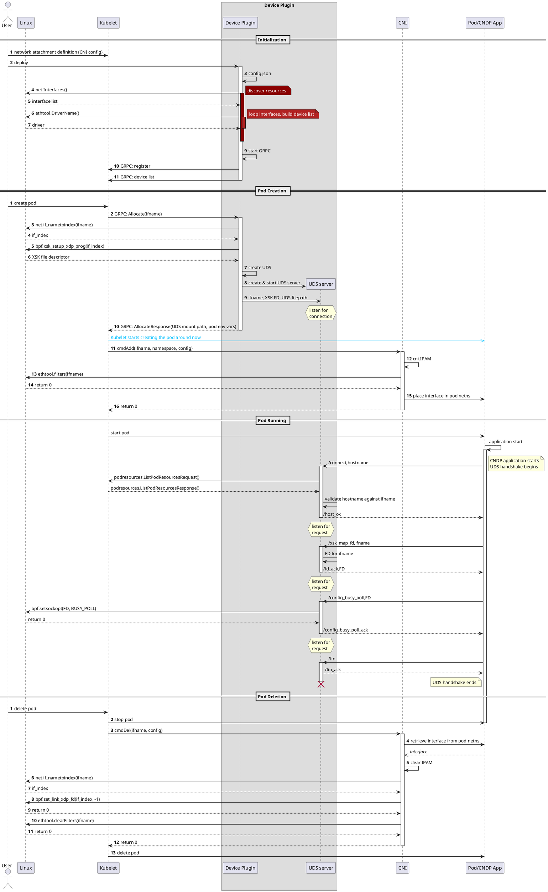

# CNDP Device Plugin

A proof of concept Kubernetes device plugin and CNI plugin to provide AF_XDP networking to Kubernetes pods using Intel's Cloud Native Data Plane framework.

## Clone and Build

```bash
git clone ssh://git@gitlab.devtools.intel.com:29418/OrchSW/CNO/containers_afxdp_network_device_plugin-.git
cd containers_afxdp_network_device_plugin-/
./build.sh
```
Two binaries will be placed in ./bin directory:
- **cndp-dp** is the device plugin
- **cndp** is the CNI plugin. This needs to be placed in `/opt/cni/bin/`

## Device Plugin Config
The device plugin currently reads a list of devices from a config file, rather than actual device discovery. A sample config file can be found in `examples/sample-config/`
For actual testing with the CNI, the config file should be updated to include only the names of real netdevs that exist on the node.
By default the device plugin will search for `config.json` in the current directory. An alternative path can be provided using the `-config` flag, e.g.
```bash
./bin/cndp-dp -config ./examples/sample-config/config.json
```


# Logging Overview

This logging framework consists of several customisable features. This is particularly helpful for debugging and helps support learning of code processes and its configurations. 


Logging configurations for CNI and Device Plugin are devised in separate files:
- **cndp-dp:**  DP Config                   `/examples/e2e-test/config.json`
- **cndp-cni:** networkAttachmentDefinition `/examples/e2e-test/nad.yaml`

## Logging Level

Specifying a logging level enables filtering and differentiation of log events based on severity.
```bash
"logLevel": "debug",
```


As illustrated above, the default logging level has been set to ```debug```, this is the maximum level of verbosity. Increasing the logging level reduces filtering and severity of log entries, meaning more basic indications are captured in the log output.  

•	```panic ```: The application has encountered a severe problem and will exit immediately.

•	```error ```: A defect has occurred i.e., invalid input or inability to access a particular service. The application will eventually exit the code.

•	```warning ```: A defect has occurred i.e., invalid input or inability to access a particular service. Application will continue irrespective of the unusual event.

•	```info ```: Basic information, indication of major code paths.

•	```debug ```: Additional information, indication of minor code branches.

## Writing to a Log File
There is also an option to log to a file on the file system. 
The file will be created on the node executing the CNI or Device Plugin.

```bash
"logFile": "debug",
````
The log file path can be configured via the logFile field. The default log file path for both the CNI and Device Plugin are set to ```/var/log/```.


## CLOC
Output from CLOC (count lines of code) - github.com/AlDanial/cloc 
<!---clocstart--->
```
-------------------------------------------------------------------------------
Language                     files          blank        comment           code
-------------------------------------------------------------------------------
Go                              20            491            647           3997
Markdown                         3            104              0            352
YAML                             6             13              2            232
Bourne Shell                     2             18              3            219
C                                2             48             24            159
make                             1             11              2             58
JSON                             3              0              0             26
C/C++ Header                     2             11             24             15
Dockerfile                       1              0              0              3
-------------------------------------------------------------------------------
SUM:                            40            696            702           5061
-------------------------------------------------------------------------------

```
<!---clocend--->

## Sequence Diagram

